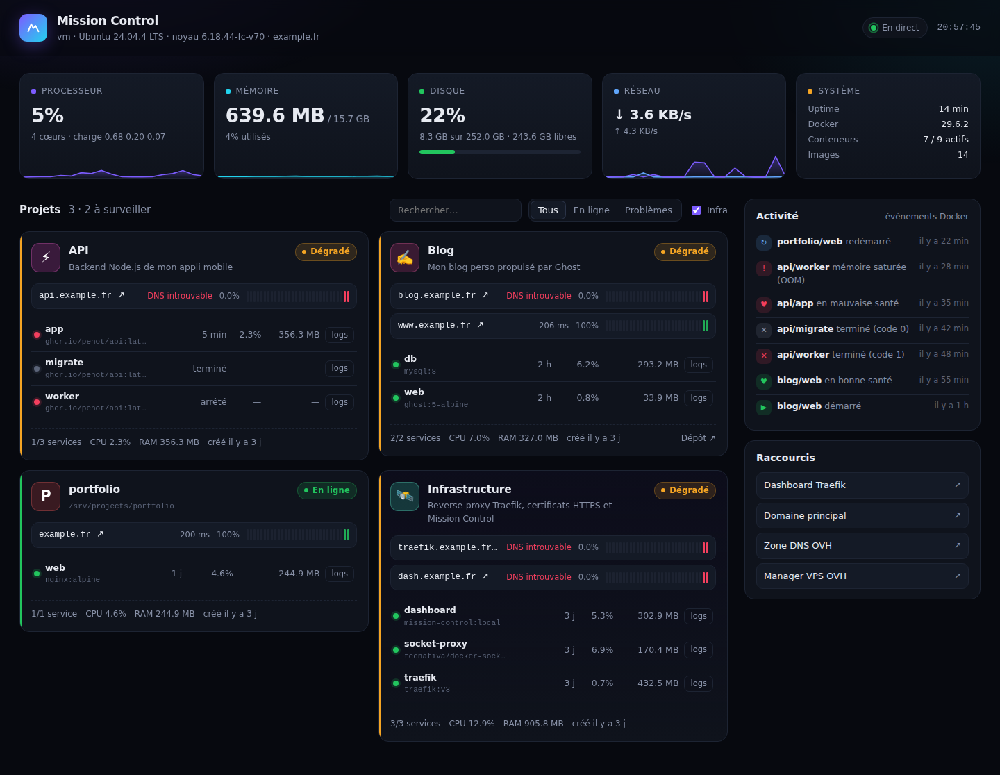

# 🛰️ VPS1 — Ton VPS OVH prêt à héberger tes projets

Un setup **versionné et reproductible** pour transformer un VPS OVH tout neuf en
plateforme d'hébergement : sécurisée, HTTPS automatique sur n'importe quel
sous-domaine, et **Mission Control**, un tableau de bord pour suivre en direct
tes projets déployés.

```
                Internet
                   │  https://*.mondomaine.fr
          ┌────────▼────────┐
          │    Traefik v3   │  ← HTTPS Let's Encrypt auto, HTTP→HTTPS, HTTP/3,
          │  (ports 80/443) │    en-têtes de sécurité, auth basique
          └──┬─────┬─────┬──┘
   réseau    │     │     │
   "proxy"   ▼     ▼     ▼
        ┌───────┐ ┌────┐ ┌──────────────────┐
        │ blog  │ │api │ │ Mission Control  │──► docker-socket-proxy ──► Docker
        └───────┘ └────┘ │ dash.domaine.fr  │    (lecture seule)
                         └──────────────────┘
   UFW : seuls 22/80/443 ouverts · Fail2ban · MAJ de sécu auto · SSH par clé uniquement
```

## Ce qui est installé

| Brique | Rôle |
|---|---|
| `bootstrap.sh` | Sécurisation de l'OS : MAJ, utilisateur admin, SSH par clé uniquement (root désactivé), pare-feu UFW, Fail2ban, mises à jour de sécurité automatiques, swap, fuseau horaire, Docker + rotation des logs |
| **Traefik v3** | Reverse-proxy : chaque projet obtient son sous-domaine en HTTPS juste avec quelques labels |
| **docker-socket-proxy** | Ni Traefik ni le dashboard n'accèdent directement au socket Docker (= root) : API filtrée, lecture seule |
| **Mission Control** | Dashboard maison (Node, zéro dépendance) — voir ci-dessous |
| `scripts/` | Créer un projet en une commande, mettre à jour l'infra, sauvegarder |

### Mission Control



- **Ressources du serveur en direct** : CPU, RAM, disque, réseau, uptime (courbes sur 10 min)
- **Une fiche par projet** (regroupement automatique par projet `docker compose`) :
  statut global (En ligne / Dégradé / Arrêté), services, CPU & RAM par conteneur, état de santé
- **Monitoring de disponibilité** : chaque URL est testée toutes les minutes (latence, uptime %, historique)
- **Journal d'activité** : démarrages, crashs (avec code de sortie), OOM, changements de santé…
- **Logs de chaque conteneur** dans le navigateur, avec filtre et suivi en direct
- Protégé par mot de passe, responsive (consultable depuis ton téléphone)

---

## 🚀 Mise en route (≈ 15 min)

### 0. Côté OVH

1. **Image du VPS** : choisis **Ubuntu 24.04** (ou Debian 12/13). Si le VPS est déjà
   installé avec autre chose : Manager OVH → ton VPS → *Réinstaller*.
2. **Clé SSH** : ajoute ta clé publique lors de l'installation (sinon OVH t'envoie un
   mot de passe par mail ; ajoute alors ta clé avec `ssh-copy-id ubuntu@IP_DU_VPS`).
   Pas encore de clé ? Sur ton PC : `ssh-keygen -t ed25519`.
3. Note l'**IPv4** (et l'IPv6) du VPS.

### 1. DNS (domaine chez OVH)

Manager OVH → **Web Cloud → Noms de domaine → ton domaine → Zone DNS** :

| Type | Sous-domaine | Cible |
|---|---|---|
| `A` | *(vide)* | `IPv4 du VPS` |
| `A` | `*` | `IPv4 du VPS` |
| `AAAA` | *(vide)* et `*` | `IPv6 du VPS` *(optionnel)* |

> Supprime les anciens enregistrements `A`/`AAAA` qui pointent vers l'hébergement
> par défaut d'OVH. Le **wildcard `*`** fait que *n'importe quel* sous-domaine
> pointe vers ton VPS : plus besoin de toucher au DNS pour un nouveau projet.
> Propagation : de quelques minutes à quelques heures.

### 2. Sécuriser le serveur

```bash
ssh ubuntu@IP_DU_VPS
git clone https://github.com/penotdev-code/VPS1.git && cd VPS1
sudo ./bootstrap.sh
```

> Le dépôt est privé ? Utilise un [token GitHub](https://github.com/settings/tokens)
> comme mot de passe lors du `git clone`, ou une *deploy key*.

⚠️ **Avant de fermer ta session**, ouvre un **nouveau terminal** et vérifie que
`ssh ubuntu@IP_DU_VPS` fonctionne toujours (le script désactive les mots de passe).

### 3. Lancer l'infra + le dashboard

Déconnecte-toi / reconnecte-toi (pour le groupe `docker`), puis :

```bash
cd VPS1
./install.sh
```

Il te demande ton domaine, ton email (Let's Encrypt) et un identifiant. Ensuite :

- **https://dash.mondomaine.fr** → Mission Control
- **https://traefik.mondomaine.fr** → dashboard Traefik

### 4. Déployer ton premier projet

```bash
./scripts/new-project.sh hello --up
```

→ **https://hello.mondomaine.fr** est en ligne, en HTTPS, et apparaît dans Mission Control. 🎉

---

## 📦 Héberger un projet

Chaque projet vit dans `/srv/projects/<nom>/` avec son `docker-compose.yml`.
Le modèle (`projects/_template/`) contient déjà tout le nécessaire. Le principe :

```yaml
services:
  web:
    build: .                     # ou image: ghcr.io/moi/mon-app:latest
    restart: unless-stopped
    networks: [proxy]            # ← réseau partagé avec Traefik
    labels:
      traefik.enable: "true"
      traefik.http.routers.monapp.rule: Host(`monapp.mondomaine.fr`)
      traefik.http.services.monapp.loadbalancer.server.port: "3000"  # port interne de l'appli
      mc.name: "Mon App"
      mc.description: "Ce que fait mon app"
      mc.icon: "🛒"
      mc.repo: "https://github.com/moi/mon-app"

networks:
  proxy:
    external: true
```

### Les règles d'or

1. **Jamais de `ports:`** dans tes projets. Docker *contourne UFW* pour les ports
   publiés : une base de données avec `ports: 5432:5432` serait exposée sur
   Internet. Tout passe par Traefik.
2. Le nom du router (`monapp`) doit être **unique** sur le serveur.
3. Les bases de données restent sur un réseau interne, jamais sur `proxy`.
4. Les secrets vont dans un `.env` à côté du compose (jamais commité).

### Labels Mission Control

| Label | Effet |
|---|---|
| `mc.name` | Nom affiché |
| `mc.description` | Description courte |
| `mc.icon` | Emoji de la fiche |
| `mc.repo` | Lien vers le dépôt |
| `mc.url` | URL(s) supplémentaires à surveiller (séparées par des virgules) |
| `mc.hidden: "true"` | Masque le conteneur du dashboard |

Les URLs sont détectées automatiquement depuis les règles `Host(...)` de Traefik.

### Middlewares prêts à l'emploi

Ajoute-les avec `traefik.http.routers.monapp.middlewares: compress@file,auth@file` :

| Middleware | Effet |
|---|---|
| `auth@file` | Protection par mot de passe (mêmes identifiants que le dashboard) |
| `compress@file` | Compression gzip/brotli |
| `rate-limit@file` | Limite de débit (50 req/s, rafale 100) |
| `security-headers@file` | HSTS, nosniff… — **déjà appliqué à tous les sites** |

---

## 🧰 Commandes utiles

```bash
./scripts/new-project.sh <nom> [domaine] [--up]   # nouveau projet
./scripts/update.sh                               # MAJ du dépôt + images d'infra
./scripts/backup.sh                               # sauvegarde projets + volumes → /srv/backups

cd /srv/projects/monapp && docker compose up -d --build   # (re)déployer
docker compose logs -f                                    # logs
sudo fail2ban-client status sshd                          # IPs bannies
sudo ufw status                                           # pare-feu
```

Changer le mot de passe du dashboard :
```bash
rm infra/traefik/auth/users && ./install.sh
```

---

## 🧭 Mes conseils pour la suite

1. **Sauvegardes hors du VPS** — c'est la priorité n°1. Active l'option *Sauvegarde
   automatique* d'OVH (snapshots quotidiens, quelques €/mois) **et/ou** planifie
   `scripts/backup.sh` en cron puis envoie `/srv/backups` vers un *OVH Object Storage*
   avec [restic](https://restic.net/). Une sauvegarde sur le même disque n'en est pas une.
2. **Déploiement continu** — pour chaque projet, une GitHub Action qui build l'image,
   la pousse sur GHCR, puis fait `ssh … docker compose pull && docker compose up -d`.
   Je peux te le mettre en place sur ton premier vrai projet.
3. **Alertes** — Mission Control affiche l'état ; pour être *notifié* (téléphone,
   mail) quand un site tombe, on peut brancher des notifications
   [ntfy](https://ntfy.sh) au dashboard, ou ajouter Uptime Kuma.
4. **Un VPS ≥ 4 Go de RAM** est confortable pour plusieurs projets + bases de données.
   Surveille la jauge mémoire du dashboard.

> **Pourquoi pas Coolify / Dokploy ?** Ce sont d'excellents PaaS « clé en main »,
> mais plus lourds et plus opaques. Ce setup reste simple (du Docker Compose
> standard), te garde la main sur tout, et tu pourras migrer vers l'un d'eux plus
> tard si tu veux une interface de déploiement par clic.

## 📁 Structure

```
bootstrap.sh            sécurisation du système (root, une seule fois)
install.sh              déploie / met à jour Traefik + Mission Control
infra/
  docker-compose.yml    stack d'infrastructure
  traefik/dynamic/      middlewares & TLS (rechargés à chaud)
  traefik/auth/         identifiants (générés, non versionnés)
dashboard/              code de Mission Control (Node.js, sans dépendance)
projects/_template/     modèle de nouveau projet
scripts/                new-project, update, backup
```
